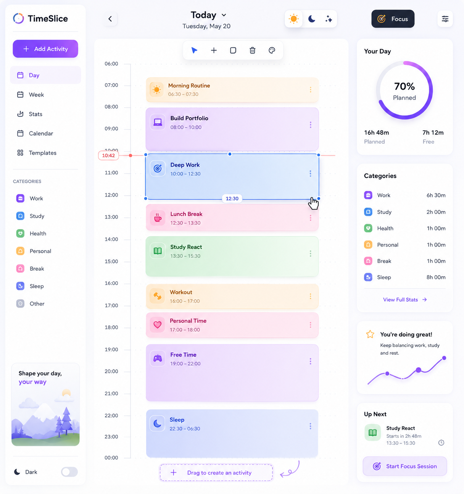
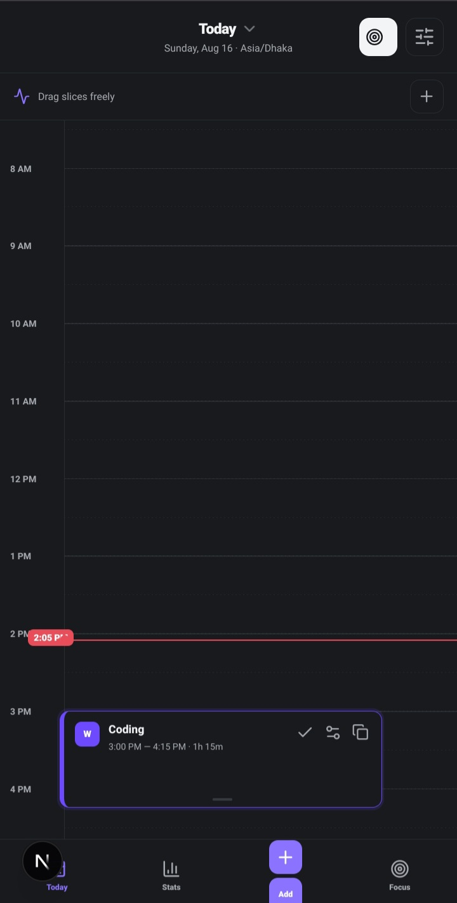

# TimeSlice

### Shape your day, your way.

TimeSlice is a visual day planner built around a simple idea: **your schedule should be something you can see and shape, not just a list of tasks.**

Move activities around the timeline, resize them, organize them by category, and see how your time is being used.

<br>

<div align="center">

<table>
<tr>
<td align="center" valign="top">

<b>Desktop Preview</b>

<br><br>



</td>

<td align="center" valign="top">

<b>Mobile Preview</b>

<br><br>



</td>
</tr>
</table>

</div>

---

## ✨ Features

- Visual day timeline
- Freeform activity positioning
- Drag activities to change their time
- Resize activities to change their duration
- Add, edit, duplicate, complete, and delete activities
- Work, Study, Health, Personal, Break, Sleep, and Other categories
- Live current-time indicator
- Automatic local timezone detection
- Schedule overlap detection
- Daily time statistics
- Category breakdown
- Focus mode
- Light and dark mode
- Responsive desktop and mobile layouts
- Automatic local schedule saving
- No account required
- No AI or external API required

---

## 🎯 The Idea

Most productivity apps start with a list of tasks.

TimeSlice treats your day as a **visual timeline**.

Instead of only asking:

> What do I need to do?

TimeSlice asks:

> **Where does it fit into my day?**

Every activity occupies a real amount of time, making it easier to see busy periods, free time, and how your day is actually divided.

---

## 🖱️ How It Works

### Add

Create an activity and choose its title, time, and category.

### Move

Drag an activity anywhere on the timeline to change when it happens.

### Resize

Change the height of an activity to adjust how much time it takes.

### Organize

Use categories to understand where your time goes.

### Track

TimeSlice automatically calculates planned time, free time, category totals, and schedule conflicts.

---

## 💾 Local & Private

TimeSlice does not require an account.

Your schedule is saved locally in your browser using `localStorage`.

```text
Your schedule
      ↓
Your browser
      ↓
localStorage
```

No server is required to store your daily activities.

Your schedule stays on the browser/device where you created it.

---

## 🕐 Local Time

TimeSlice automatically uses the timezone provided by your device or browser.

The current-time indicator follows your local clock, so the planner works naturally across different timezones.

---

## 📱 Responsive Design

TimeSlice has separate layouts for desktop and mobile.

The desktop version provides a larger workspace for the timeline, navigation, categories, and statistics.

The mobile version removes the desktop sidebar and focuses on the timeline so the interface remains comfortable to use on smaller screens.

---

## 🛠️ Built With

- [Next.js](https://nextjs.org/)
- [React](https://react.dev/)
- [TypeScript](https://www.typescriptlang.org/)
- CSS
- [Motion](https://motion.dev/)
- [React RND](https://github.com/bokuweb/react-rnd)
- [Lucide React](https://lucide.dev/)
- Browser `localStorage`

---

## 📁 Project Structure

```text
src/
├── app/
│   ├── globals.css
│   ├── layout.tsx
│   └── page.tsx
│
├── components/
│   └── TimeSlice.tsx
│
└── lib/
    ├── data.ts
    └── types.ts
```

### Main Files

**`src/app/page.tsx`**  
Entry point for the application.

**`src/components/TimeSlice.tsx`**  
Main planner interface, timeline interactions, activity management, statistics, and application state.

**`src/lib/data.ts`**  
Timeline configuration and activity categories.

**`src/lib/types.ts`**  
TypeScript types used throughout the application.

**`src/app/globals.css`**  
Main styling, responsive layouts, and animations.

---

## 🚀 Getting Started

### Requirements

- Node.js
- npm
- A modern web browser

### Installation

Clone the repository:

```bash
git clone https://github.com/rafiul-cr/timeslice.git
```

Enter the project:

```bash
cd timeslice
```

Install dependencies:

```bash
npm install
```

Start the development server:

```bash
npm run dev
```

Open:

```text
http://localhost:3000
```

---

## 🔮 Future Ideas

Some possible directions for future versions:

- Weekly planning
- Recurring activities
- Custom categories
- Schedule templates
- Export and import
- Shareable schedules
- PWA support
- Notifications and reminders
- More detailed statistics
- Calendar integration
- Optional cloud synchronization

---

## 📌 Project Status

**Personal portfolio project.**

TimeSlice was built as a practical project for exploring interactive UI, React state management, TypeScript, drag-and-resize interactions, time-based interfaces, browser storage, responsive design, and animations.

---

<div align="center">

### TimeSlice

*Shape your day, your way.*

**Built by [rafiul-cr](https://github.com/rafiul-cr)**

</div>* — see when activities overlap
- **Daily statistics** — understand how your time is distributed
- **Focus mode** — concentrate on the activity you're working on
- **Light & dark mode**
- **Responsive mobile interface**
- **Local schedule saving** — your schedule stays after refreshing
- **No account required**
- **No AI or external API required**

---

## 🎯 The Idea

Most productivity apps start with a list:

```text
☐ Study React
☐ Work on portfolio
☐ Go to the gym
☐ Watch a movie
```

TimeSlice takes a different approach.

Instead of only asking:

> **What do I need to do?**

it asks:

> **Where does it fit into my day?**

Every activity occupies a real amount of time on the timeline.

You can visually see when you're busy, where you have free time, and how your day is divided between different categories.

---

## 🖱️ How It Works

### 1. Add an activity

Create an activity and choose:

- Title
- Start time
- End time
- Category

### 2. Shape it on the timeline

Drag the activity to change when it happens.

Resize it to change its duration.

### 3. Organize your day

Use categories to quickly understand where your time goes.

### 4. Track your day

TimeSlice calculates planned time, free time, category totals, and schedule conflicts automatically.

---

## 📊 Time-Based Planning

Activities are represented using their start and end times.

For example:

```ts
{
  title: "Study React",
  start: 810,
  end: 930,
  category: "study",
  completed: false
}
```

The application converts these values into positions on the timeline.

Moving an activity changes its start time.

Resizing an activity changes its duration.

The interface then updates the rest of the schedule automatically.

---

## 💾 Local & Private

TimeSlice does not require an account for the main planner.

Your schedule is stored in your browser using `localStorage`.

```text
Your schedule
      ↓
Your browser
      ↓
localStorage
```

There is no server required to store your activities.

This also means your schedule is specific to the browser/device where you created it.

If the browser's site data is cleared, the locally stored schedule will also be removed.

---

## 🕐 Automatic Local Time

TimeSlice automatically uses the timezone provided by your device/browser.

There is no need to manually select a timezone.

The current-time indicator follows the user's local clock, making the planner work naturally for users in different locations.

---

## 📱 Responsive Design

TimeSlice has separate layouts for desktop and smaller screens.

### Desktop

The desktop interface gives the timeline most of the workspace while providing navigation, categories, statistics, and additional controls around it.

### Mobile

The mobile interface removes the desktop sidebar and prioritizes the timeline so activities remain easy to view and interact with on a smaller screen.

---

## 🛠️ Built With

- [Next.js](https://nextjs.org/)
- [React](https://react.dev/)
- [TypeScript](https://www.typescriptlang.org/)
- CSS
- [Motion](https://motion.dev/)
- [React RND](https://github.com/bokuweb/react-rnd)
- [Lucide React](https://lucide.dev/)
- Browser `localStorage`

---

## 📁 Project Structure

```text
src/
├── app/
│   ├── globals.css
│   ├── layout.tsx
│   └── page.tsx
│
├── components/
│   └── TimeSlice.tsx
│
└── lib/
    ├── data.ts
    └── types.ts
```

### Main Files

**`src/app/page.tsx`**

The entry point for the application.

**`src/components/TimeSlice.tsx`**

Contains the main planner interface, timeline interactions, activity management, statistics, and application state.

**`src/lib/data.ts`**

Contains timeline configuration and activity categories.

**`src/lib/types.ts`**

Contains the TypeScript types used throughout the application.

**`src/app/globals.css`**

Contains the main visual styling, responsive layouts, and animations.

---

## 🚀 Getting Started

### Requirements

- Node.js
- npm
- A modern web browser

### Installation

Clone the repository:

```bash
git clone https://github.com/your-username/timeslice.git
```

Enter the project directory:

```bash
cd timeslice
```

Install dependencies:

```bash
npm install
```

Start the development server:

```bash
npm run dev
```

Open the application at:

```text
http://localhost:3000
```

---

## 🔮 Future Ideas

TimeSlice is intentionally focused on the core planning experience, but there are plenty of directions it could go.

Possible future improvements:

- Weekly timeline
- Recurring activities
- Custom categories
- Schedule templates
- Export and import
- Shareable schedules
- PWA support
- Notifications and reminders
- More detailed statistics
- Calendar integration
- Optional cloud synchronization

---

## 📌 Project Status

**Personal portfolio project — actively experimenting and improving.**

TimeSlice was built as a practical project for exploring:

- Interactive interfaces
- React state management
- TypeScript
- Drag and resize interactions
- Time-based UI
- Browser storage
- Responsive design
- Mobile-first interfaces
- CSS animations

---

<div align="center">

**TimeSlice**

*Shape your day, your way.*

</div>
